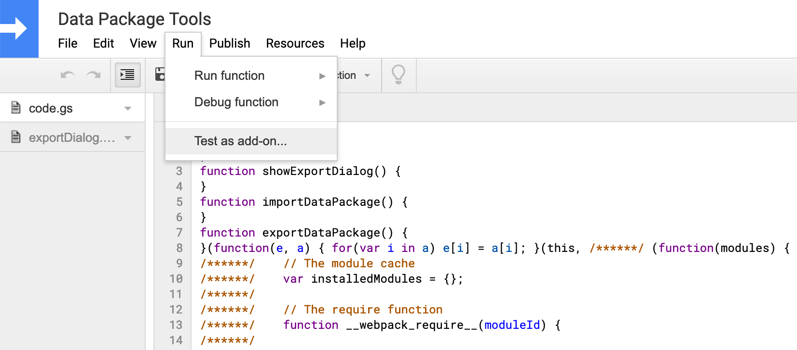

# Data Package Tools for Google Sheets

## Setup

First make sure to enable the Google Apps Script API in your [Google account](https://script.google.com/home/usersettings).


Now install `clasp` and login.

```shell
$ npm i -g @google/clasp
$ clasp login
```

> Note: `clasp` is also a dependency of this add-on, but having it available globally is more convenient than calling `./node_modules/.bin/clasp`.

Clone this repo, navigate to the root folder and create a new *standalone* Google Apps Script project via `clasp`.

```shell
$ git  clone https://github.com/frictionlessdata/googlesheets-datapackage-tools.git
$ cd googlesheets-datapackage-tools
$ clasp create --type standalone --title "Data Package Tools" --rootDir ./dist
```

Lastly, install the dependencies and run the `start` task.

```
$ npm i
$ npm start
```

This kicks off `nodemon` that does two things whenever a file in the `src` folder changes:

1. Tell webpack to build the add-on into the `dist` folder.
2. Let `clasp` push this folder to the Google cloud.

You are done 🎉 The Data Package Tools are ready to be tested.

## Testing

Running

```
$ npm test
```

first executes unit tests and then calls `clasp open`. I call the latter blatantly `test:e2e`, but it is of course not a real automated end-to-end test. Read on how to test the Data Package Tools out in the wild, though.

### End-to-end Testing

`clasp` has opened the `Data Package Tools` project. Click `Run` and then `Test as add-on` to fire up the testing dialog.



Leave all the default settings, press `Select Doc` to choose a spreadsheet you want to test against and hit `Save`. Now choose the test you just created and hit `Test`.

You can now play around with the Data Package Tools as if they where installed via the Chrome Store.
